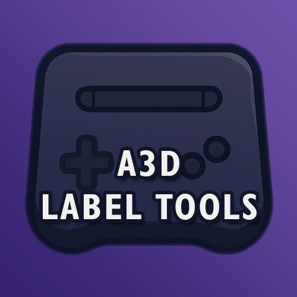
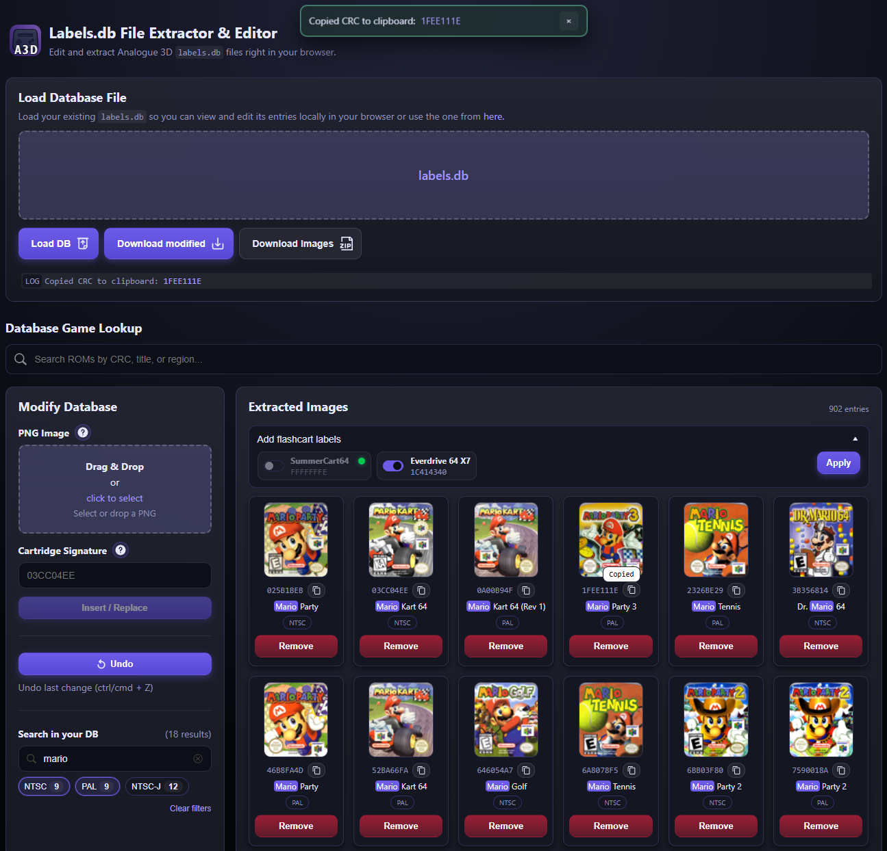

# 🎮 Analogue 3D Labels.db File Extractor & Editor



## Web App here: https://a3d-tools.online

#### For self-hosted see [docker part](#docker-compose-self-hosting)

_A modern, browser-based editor for Analogue 3D `labels.db` files_

The **Labels.db File Editor** is a fully client-side web application for viewing, editing, and creating `labels.db` files used by the Analogue 3D.  
All processing happens locally in your browser – no data is ever uploaded to a server.



> **Important safety note**  
> Always create a backup of your original `labels.db` before overwriting it with the generated `labels_modified.db`.  
> If something goes wrong, restoring the backup is the only way back to the original state.

---

## Features

### Load and inspect `labels.db`

- Open an existing `labels.db` directly in your browser via file chooser.
- The app parses:
  - the header,
  - the cartridge signature index,
  - the image blocks
  - region (PAL, NTSC, NTSC-J and PAL-M)
  - rom name based on self-builded db (Incompleteness may occur)
- All detected entries are displayed as a responsive grid of “cards”.

---

### Logging

- The app will log your latest change inside the top panel ("LOG") and provide you with a toas-popup
- In the log or notification, you will find a link to your added entry. Click on it to scroll down and highlight the entry.

---

### Database Game Lookup

- A complete custom builded and mapped Database (by me) where you can look for your game if it not exists in DB.
- After searching for a game, the filtered result list will appear and you can sort the rows by asc or desc.
- Copy the CRC header once you have found your game and want to add it.

---

### Thumbnail preview grid

- All label images are rendered to PNG on the fly.
- This gives you a clear overview of what’s currently stored in your `labels.db`.
- Copy CRC-Herader to clipboard functionality

---

### Search inside your loaded DB

- You can serch inside your loaded db by using "Search in your DB"
- Substrings or CRC codes (comma-separated) are possible, app will highlight entries
- You can filter region-badges or reset all filters by pressing "Clear filters"

---

### Add or replace label images

The “Modify Database” panel allows you to insert or update entries:

1. **Select a PNG image**
   - Any size is accepted.
   - The app automatically resizes the image to **74×86 pixels**.

2. **Enter the cartridge signature (CRC32)**
   - 8-digit hexadecimal string, e.g. `98E67875`.
   - This is the signature that Analogue 3D uses to match cartridges.
   - Use "Database Game Lookup" if you need to find your specificc entry.

3. **Insert / Replace**
   - If the CRC already exists in the database:
     - The existing label image for that CRC is replaced.
   - If the CRC does not exist:
     - A new entry is appended to the in-memory list.
   - Undo button to revert last change

4. **Batch download Images**
   - If the .db was extracted successfully, you will be able to download the extraced images as .zip-file via the "Download Images (ZIP)"-button.

All changes happen **in-memory** until you download the modified file.

---

### Inject flashcart images

Added ability to inject missing flashcart labels like for "SummerCard 64" or "Everdrive 64 X7" by Krikzz.
Just switch on the flashcart you want to add the label to DB and hit "Apply".
It will auto-detect if one of those entries are already in DB.

---

### Remove existing labels

- Each card in the grid includes a **Remove** button.
- Clicking it:
  - Gives you a "Yes" oor "No" option. When clicking "Yes":
    - It removes the signature and image at that index from the in-memory database.
  - You can revert your last change by using crtl/cmd + z or by clicking the "Undo"-Button

Nothing is written back to disk until you explicitly download and replace `labels.db`.

---

### Export a new `labels.db`

- Once you are satisfied with your changes:
  - Click **“Download modified”**.
  - The resulting file is downloaded as `labels_modified.db`.

> **⚠️ Recommended workflow**
>
> 1. Backup your original `labels.db` from the SD card.
> 2. Rename `labels_modified.db` to `labels.db`.
> 3. Copy it onto the SD card, replacing the original.
> 4. If anything behaves unexpectedly, restore the backup.

---

## How it works (internals overview)

This is a simplified description of how the editor interprets `labels.db`.

### File layout

- `0x0000–0x00FF` – **Header**
- `0x0100–0x40FF` – **Cartridge signature index**
  - 32-bit little-endian words.
  - Each value is a **CRC32 signature** of a cartridge.
  - The list is sorted in ascending order.
  - Unused entries are filled with `0xFFFFFFFF`.

- `0x4100–EOF` – **Image data**
  - Each image is a fixed-size block of **25,600 bytes**:
    - 74 × 86 pixels
    - 4 bytes per pixel (BGRA)
    - plus padding up to 25,600 bytes total.
  - Images appear in the same order as their signatures in the index.

The editor:

- Parses the header as-is.
- Extracts signatures until it hits `0xFFFFFFFF`.
- Reads each image block as raw BGRA data and renders it to PNG for the preview.

When exporting:

- The app resorts signatures and aligns the image order accordingly.
- The index region is fully rewritten with signatures followed by `0xFFFFFFFF` padding.
- Image blocks are written sequentially from `0x4100` onward.

---

## Cartridge signatures (CRC32)

The **cartridge signature** is a 32-bit CRC32 value, represented as an 8-digit hex string (e.g. `98E67875`).
The Analogue 3D does not use the CRC32 of the full ROM.
Instead, it calculates a signature by hashing only the first 8 KiB (8192 bytes) of the ROM using the standard IEEE CRC32 polynomial.

According to reverse engineering efforts:

- The Analogue 3D uses a CRC32 computed over the **first 8 KiB of the game ROM** to identify cartridges.
- This CRC32 is then stored in the `labels.db` as:
  - **Little-endian 32-bit** word in the index region.

In the editor:

- You always work with the **human-readable, big-endian hex string** (e.g., `98E67875`).
- The app internally converts it to a numeric value and embeds it correctly in the `labels.db` structure.

> The editor does not compute CRC32 from ROM files (yet).  
> It expects you to provide the CRC32 value – for example from your own tooling or known cartridge signature lists.

---

## Privacy & Security

- All operations (parsing, editing, preview rendering, export) are executed **fully in the browser**.
- No external servers, APIs, or uploads are involved.
- This makes the tool suitable for:
  - Offline use
  - Sensitive local setups
  - Environments without internet connectivity.

---

## Docker Compose (self-hosting)

The project now ships with a multi-stage Docker build so Compose produces a static site image automatically.

Files:

- `Dockerfile` – builds the app with Node, then serves the compiled `dist/` via nginx.
- `docker-compose.yml` – uses the Dockerfile (no volume mount) and exposes port `4377` by default.
- `.dockerignore` – keeps the image lean (skips `node_modules`, `dist`, git, editor cruft).

### Usage

```bash
docker compose build
docker compose up -d
```

Then open: `http://localhost:4377`

Compose will build the assets inside the container and serve the optimized static bundle from nginx. No manual `npm run build` needed outside the container.

### NPM scripts

- `npm run dev` – start Vite dev server for local development.
- `npm run build` – create a production build in `dist/`.
- `npm run preview` – serve the built `dist/` locally to validate the production bundle.

## Credits:

- Web UI inspired by enoznal.com on https://enoznal.com/3d/labels.html
- Extractor inspired by maspling via https://github.com/maspling/a3dlabel
